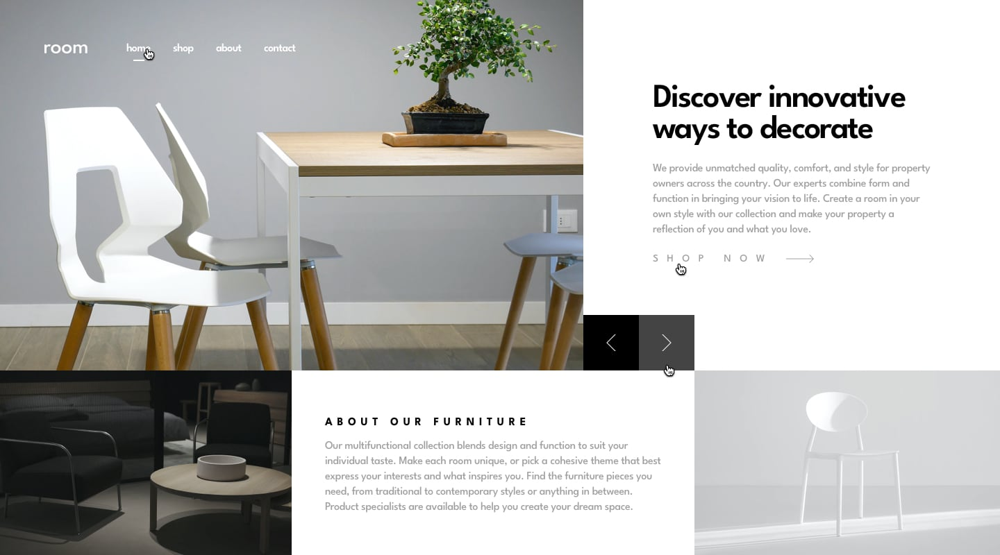

# 🛋️ Room Homepage

This is a solution to the [Room homepage challenge on Frontend Mentor](https://www.frontendmentor.io/challenges/room-homepage-BtdBY_ENq). The goal was to build a modern, responsive homepage with an image slider and clean, interactive UI components.

---

## 📋 Table of Contents

- [Overview](#overview)
  - [Screenshots](#screenshots)
  - [Live Links](#live-links)
  - [Built With](#built-with)
- [Author](#author)

---

## Overview

Users should be able to:

- View a responsive layout on all screen sizes.
- Navigate the image slider using mouse, trackpad, or keyboard.
- See smooth hover states for interactive elements.
- Toggle mobile navigation menu with a clean overlay effect.
- Enjoy an elegant and minimal design with responsive typography and spacing.

---

### Screenshots

#### 🖥️ Desktop

#### 📱 Mobile

---

### Live Links

- 📁 GitHub Repository: [Room Homepage](https://github.com/vedantagrawal524/room-homepage)
- 🌐 Live Site: [https://room-homepage524.vercel.app/](https://room-homepage524.vercel.app/)

---

### Built With

- HTML5
- Tailwind CSS
- JavaScript
- Mobile-first workflow
- Flexbox & Grid
- [Vercel](https://vercel.com/) for deployment

---

## Author

- Portfolio – _Vedant Agrawal_
- Frontend Mentor – [@vedantagrawal524](https://www.frontendmentor.io/profile/vedantagrawal524)
- GitHub – [@vedantagrawal524](https://github.com/vedantagrawal524)

---

📌 _Feel free to fork, give a ⭐, or share your feedback. Crafted with precision and Tailwind flair._
